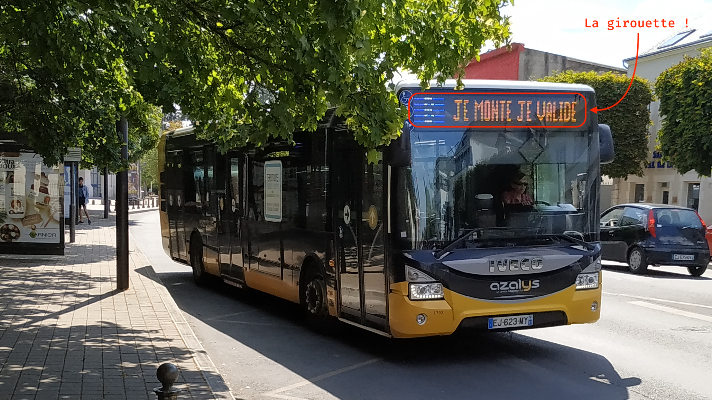
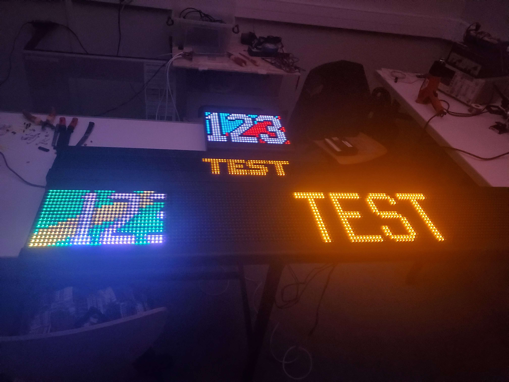

Nous avons récemment repris l'association des étudiants en informatique. Mais comme elle à été abandonnée pendant 2 ans, il faut faire savoir que l'association existe encore !

Dans le bureau, il y à Max, et Max aime **beaucoup** les trains et les bus. Et il à eu une idée incroyable : récupérer un les afficheurs de bus (où sont écrites les destinations) pour pouvoir informer les gens des actualités de l'association.

Dans le jargon des transports, ces afficheurs s'appellent des [girouettes](https://fr.wikipedia.org/wiki/Girouette_(transport_en_commun).

Nous avons envoyé des mails à beaucoup de 

 - max (aime les trains et le bus)
 - il faut faire de la pub
 - on va chercher la girouette
 - câblage

