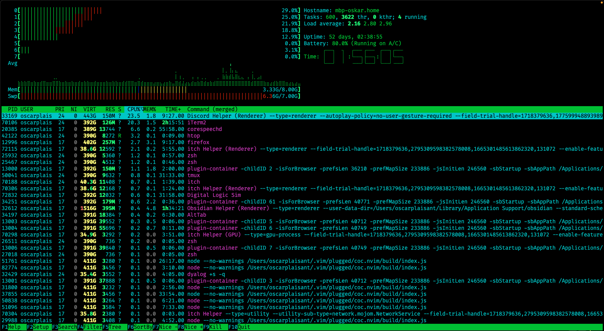
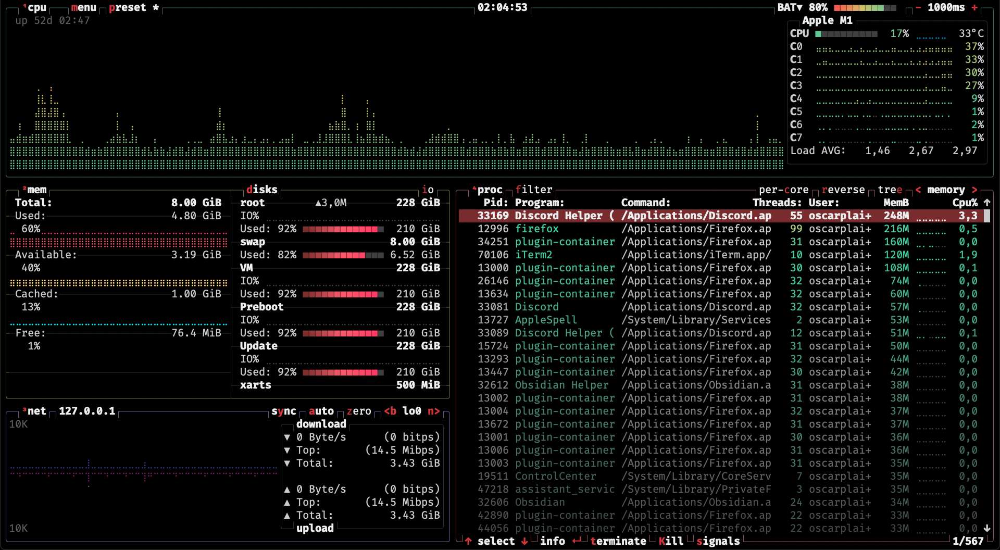
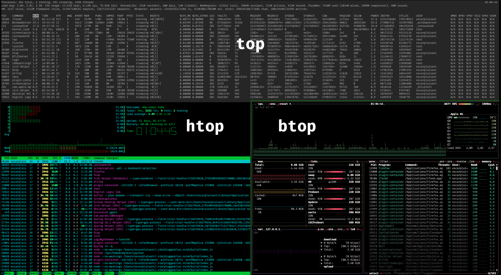

`btop` est un utilitaire pour visualiser les processus actifs sur votre ordinateur, et les statistiques comme la quantité d'entrée/sortie en mémoire ou réseau.

Dépôt github de `btop` : [aristocratos/btop](https://github.com/aristocratos/btop)

# Pourquoi `btop` ?

Il existe de nombreuses alternatives à `btop`. Il est lui-même dérivé de `bashtop` et `bpytop`.

L'outil similaire le plus connu est certainement `top`, qui permet d'afficher la liste des processus en cours sur votre machine, ainsi que des statistiques sur la charge du processeur ou de la mémoire. `top` à l'avantage d'être présent sur presque toutes les machines Linux.

Ceci dit, top est très simple dans son interface, et très peu intuitif.

## `htop`

Un autre utilitaire très connu est `htop`, qui est une version plus jolie et utilisable de `top`, qui permet de chercher et filtrer les processus selon leur nom.

`htop` est beaucoup plus agréable à utiliser que `top`, avec des raccourcis plus intuitifs, des boutons cliquables (oui, c'est possible sur un terminal), et une interface plus agréable.

Voici à quoi ressemble `htop` :

## `btop`

`btop` est un autre utilitaire du même type, mais il a quelques avantages :

 - il est plus intuitif
     - les raccourcis clavier sont affichés
     - le menu d'options est bien fait (plus simple à utiliser que celui de `htop`)
 - il est plus joli
 - il permet de voir plus de statistiques

Les raccourcis claviers sont montrés par la lettre en rouge dans leur nom (comme `m` pour aller dans le <code style="color: white">menu</code>), et chaque fenêtre peut être affichée/masquée en appuyant sur le chiffre qui lui correspond (de 1 à 4).

# Comparaison

Voici une comparaison des interfaces des 3 outils dont j'ai parlé : `top`, `htop` et `btop`

# Installer `btop`

`btop` est disponible sur la plupart des distributions linux et sur macOS. Il est probablement disponible pour votre installeur habituel (et avec `homebrew` sur macOS).

 - macOS : `brew install btop`
 - ubuntu : `sudo apt-get update && sudo apt install btop`

