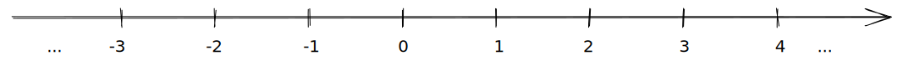
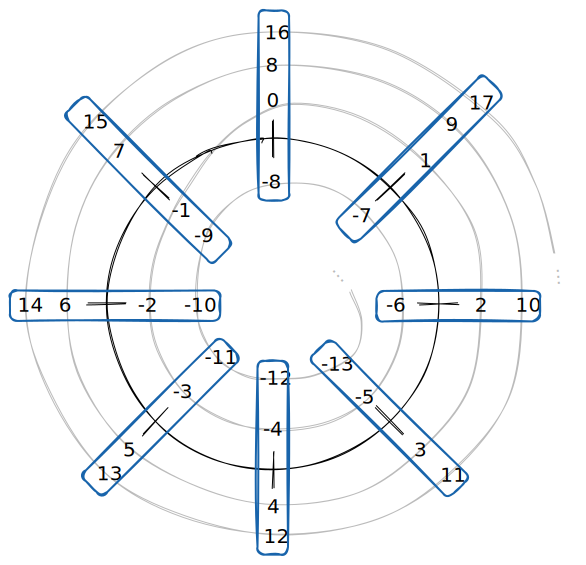

::: {.callout-note icon=false}
## Définition

Soient $a$ et $b$ deux entiers relatifs
 
Soit $n$ un entier naturel non nul

On dit que **$a$ est congru à $b$ modulo $n$**, et on note $a \equiv b [n]$ si et seulement si $n \mid a - b$

Cela peut être interprété comme le fait que $a$ et $b$ ont le même reste pour la division euclidienne par $n$ (c'est une autre définition).

Une dernière définition est que $a \equiv b [n]$ si et seulement si il existe un entier relatif $k$ tel que $a - b = kn$ (si $a-b$ est un multiple de $n$). Cette définition est équivalente à $a - b \mid n$ (voir la définition de la [divisibilité](maths%20divisibilité.md))

##### Exemples

 - on sait que $13 \equiv 28 [5]$ car $13$ et $28$ ont tous les deux un même reste de $3$ dans la division par $5$
 - on sait que $15 \equiv 2 [6]$ car $15 - 2 = 12$ et car $12$ est multiple de $6$
:::

## Comprendre la congruence

On sait que les nombres de $\mathbb{Z}$ peuvent être représentés sur une droite :

De la même manière, on peut représenter les entier **modulo $n$**... sur un cercle !

On va "enrouler" la droite sur elle-même, en mettant au même endroit les nombres qui sont congrus modulo $n$.

Par exemple, voici le cercle des entiers modulo $8$ :

Les nombres dans chaque groupe en bleu sont ceux qui sont congrus modulo $8$. En quelque sorte, ce sont les mêmes nombre dans ce système : on peut les utiliser de la même manière dans une addition, multiplication etc., et le résultat sera le même modulo 8.

Quand on travaille modulo $n$, la congruence joue le même rôle que l'égalité.

## Propriétés

::: {.callout-tip}
## Congruence à $0$

Soit $a \in \mathbb{Z}$

$a \equiv 0 [n]$ si et seulement si $n \mid a$ ($a$ est divisible par $n$)
:::

::: {.callout-tip}
## Congruence à lui-même

Comme avec l'égalité classique, 

:::

::: {.callout-tip}
## Transitivité de la congruence

Soit $n$ un entier strictement positif
 
Soient $a$, $b$ et $c$ des entiers relatifs

Si $a \equiv b [n]$ et $b \equiv c [n]$, alors : $a \equiv b [n]$

On connaît cette propriété pour l'égalité : si $a = b$ et $b = c$, alors $a = c$.
:::

::: {.callout-tip}
## Opérations dans des congruences

Soit $n$ un entier strictement positif
 
Soient $a$, $A$, $b$, $B$ et $k$ des entiers relatifs
 
avec $a \equiv A[n]$ et $b \equiv B[n]$

On a :

 - $a + b \equiv A + B [n]$
     - Donc $a + k \equiv A + k [n]$
 - $a - b \equiv A - B [n]$
     - Donc $a - k \equiv A - k[n]$
 - $ab \equiv AB [n]$
     - Donc $ak \equiv Ak [n]$
 - $a^{p} \equiv A^{p}[n]$ (pour tout $p \in \mathbb{N}$)

En fait, si on a commris que la congruence est une sorte d'égalité quand on est modulo $n$, toutes ces propriétés sont évidentes.
:::